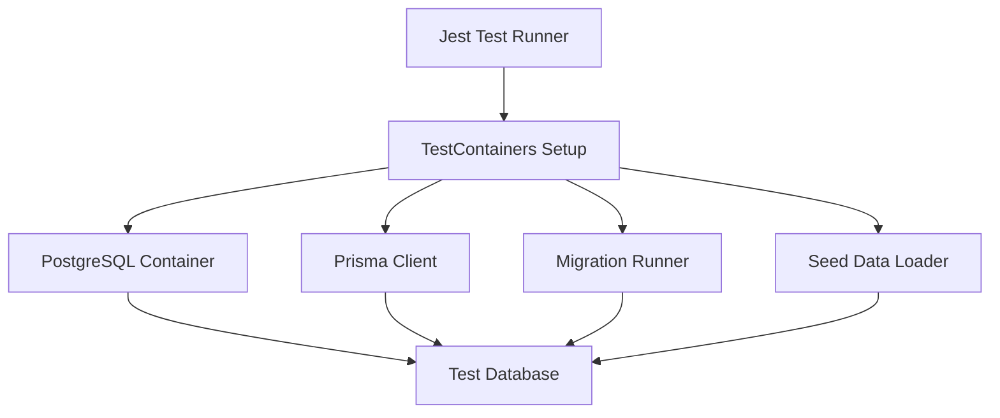

# TestContainers Setup Documentation

## Overview

This document describes the TestContainers setup for running database integration tests with real PostgreSQL instances in isolated Docker containers.

## Architecture



## Installation

```bash
# Install required dependencies
npm install --save-dev @testcontainers/postgresql testcontainers pg

# Verify Docker is running
docker version
```

## Configuration

### 1. Jest Configuration

Database tests use a specific Jest configuration:

```javascript
// config/jest/jest.config.db.js
module.exports = {
  testEnvironment: 'node',
  testMatch: ['**/*.db.test.ts'],
  setupFilesAfterEnv: ['<rootDir>/tests/setup/jest-testcontainers-setup.ts'],
  maxWorkers: 1, // Run sequentially
  testTimeout: 120000, // 2 minutes for container startup
};
```

### 2. Environment Variables

TestContainers automatically sets these environment variables:
- `DATABASE_URL`: Connection string for Prisma
- `DIRECT_DATABASE_URL`: Direct connection string
- `TEST_DATABASE_URL`: Test-specific connection string

## Usage

### Running Database Tests

```bash
# Run all database tests
npm run test:db

# Run database tests in watch mode
npm run test:db:watch

# Debug database tests
npm run test:db:debug

# Run specific test file
npm run test:db -- user-repository.db.test.ts
```

### Test Structure

```typescript
import { dbTestUtils } from '../../utils/db-test-utils';

describe('Database Integration Test', () => {
  let prisma: PrismaClient;

  beforeAll(async () => {
    prisma = dbTestUtils.getPrisma();
    await dbTestUtils.waitForDatabase();
  });

  afterAll(async () => {
    await dbTestUtils.disconnect();
  });

  it('should perform database operation', async () => {
    // Your test code
  });
});
```

### Test Utilities

The `dbTestUtils` provides helper methods:

```typescript
// Create test data
const user = await dbTestUtils.createTestUser();
const session = await dbTestUtils.createTestSession(user.id);
const marketData = await dbTestUtils.createTestMarketData();

// Clean specific tables
await dbTestUtils.cleanTables(['users', 'sessions']);

// Execute raw SQL
await dbTestUtils.executeRaw('DELETE FROM users WHERE email LIKE ?', ['test%']);

// Query raw SQL
const results = await dbTestUtils.queryRaw('SELECT COUNT(*) FROM users');
```

## Migration Management

### Running Migrations for Tests

```bash
# Run migrations on test database
npm run db:test:migrate

# Keep container running after migration (for debugging)
npm run db:test:migrate -- --keep
```

### Migration Script Features

1. **Automatic Container Management**: Starts and stops PostgreSQL container
2. **Schema Synchronization**: Applies Prisma schema using `db push`
3. **SQL Migration Support**: Runs custom SQL files from `supabase/migrations`
4. **Seed Data**: Automatically loads test fixtures
5. **Verification**: Lists all created tables

## Best Practices

### 1. Test Isolation

Each test should be independent:

```typescript
beforeEach(async () => {
  // Clean database before each test
  await testDb.cleanDatabase();
});
```

### 2. Performance Optimization

For large test suites:

```typescript
// Use transactions for faster cleanup
const tx = await prisma.$transaction(async (prisma) => {
  // Multiple operations
});

// Batch operations
await prisma.marketData.createMany({
  data: largeDataset,
  skipDuplicates: true,
});
```

### 3. Debugging Failed Tests

```typescript
// Enable query logging
const prisma = new PrismaClient({
  log: ['query', 'error', 'warn'],
});

// Check container logs
docker logs $(docker ps -q --filter ancestor=postgres:16-alpine)
```

### 4. CI/CD Integration

```yaml
# GitHub Actions example
- name: Run Database Tests
  run: |
    npm run test:db
  env:
    DOCKER_HOST: unix:///var/run/docker.sock
```

## Troubleshooting

### Common Issues

1. **Container Startup Timeout**
   ```bash
   # Increase timeout in jest.config.db.js
   testTimeout: 300000 // 5 minutes
   ```

2. **Port Conflicts**
   ```typescript
   // TestContainers automatically finds free ports
   // No manual configuration needed
   ```

3. **Database Connection Errors**
   ```typescript
   // Use retry logic
   await dbTestUtils.waitForDatabase(30, 1000);
   ```

4. **Memory Issues**
   ```bash
   # Limit container resources
   new PostgreSqlContainer()
     .withSharedMemorySize(256 * 1024 * 1024)
     .withTmpFs({ '/var/lib/postgresql/data': 'rw' });
   ```

## Advanced Features

### 1. Container Reuse

```typescript
// Enable container reuse for faster tests
new PostgreSqlContainer()
  .withReuse()
  .start();
```

### 2. Custom PostgreSQL Configuration

```typescript
new PostgreSqlContainer()
  .withCommand([
    '-c', 'max_connections=200',
    '-c', 'shared_buffers=256MB',
  ])
  .start();
```

### 3. Network Testing

```typescript
// Create custom network for multi-container tests
const network = await new Network().start();
const pgContainer = await new PostgreSqlContainer()
  .withNetwork(network)
  .start();
```

## Performance Metrics

Typical performance benchmarks:

- Container startup: 3-5 seconds
- Schema migration: 1-2 seconds
- Database cleanup: <100ms per test
- Total overhead: ~5 seconds for first test

## Security Considerations

1. **Isolated Containers**: Each test run uses a fresh container
2. **Random Credentials**: TestContainers generates random passwords
3. **Network Isolation**: Containers run in isolated networks
4. **Automatic Cleanup**: Containers are removed after tests

## Maintenance

### Updating PostgreSQL Version

```typescript
// In testcontainers.ts
new PostgreSqlContainer('postgres:17-alpine')
```

### Monitoring Container Health

```bash
# Check running containers
docker ps --filter label=org.testcontainers=true

# Clean up orphaned containers
docker container prune --filter label=org.testcontainers=true
```

## References

- [TestContainers Documentation](https://testcontainers.com/)
- [TestContainers Node.js](https://node.testcontainers.org/)
- [Prisma Testing Guide](https://www.prisma.io/docs/guides/testing)
- [PostgreSQL Docker Image](https://hub.docker.com/_/postgres)