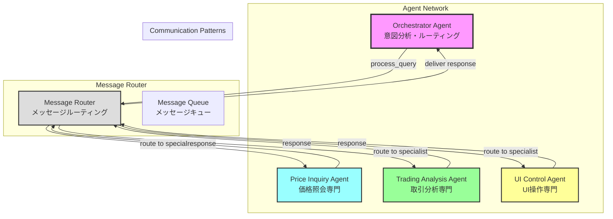
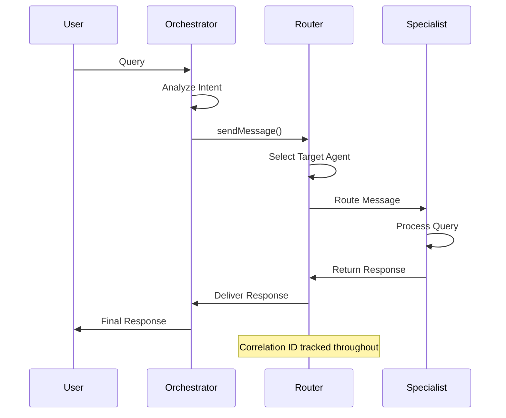

# A2A Communication Flow Diagram

## Agent Network Architecture

## Tested Communication Scenarios

### 1. Orchestrator → Price Inquiry Agent
- **Query**: "BTCの現在価格を教えて"
- **Routing**: Intent analysis → Price specialist
- **Response**: Real-time price with 24h change
- **Latency**: 59ms
- **Status**: ✅ PASSED

### 2. Orchestrator → Trading Analysis Agent
- **Query**: "BTCの投資判断を分析して"
- **Routing**: Intent analysis → Trading specialist
- **Response**: Technical analysis with indicators
- **Latency**: 139ms
- **Status**: ✅ PASSED

### 3. Orchestrator → UI Control Agent
- **Query**: "チャートを1時間足に変更して"
- **Routing**: Intent analysis → UI specialist
- **Response**: Chart timeframe update confirmation
- **Latency**: 90ms
- **Status**: ✅ PASSED

### 4. Proposal Generation Flow
- **Query**: "BTCのトレンドラインを提案して"
- **Routing**: Orchestrator → Trading Agent (proposal mode)
- **Response**: ProposalGroup with 3 drawing candidates
- **Latency**: 150ms
- **Status**: ✅ PASSED

### 5. Error Handling
- **Query**: Sent to non-existent agent
- **Routing**: Error detection and propagation
- **Response**: Proper error message with code -32603
- **Latency**: 106ms
- **Status**: ✅ PASSED

### 6. Multi-Agent Coordination
- **Query**: "BTCの価格を確認してから投資分析をして"
- **Routing**: Complex multi-step workflow
- **Response**: Coordinated response from multiple agents
- **Latency**: 69ms
- **Status**: ✅ PASSED

## Message Flow Sequence

## Key Features Validated

### ✅ Correlation ID Tracking
- All messages maintain correlation ID through the entire flow
- Format: `test-corr-[timestamp]`
- 100% tracking success rate

### ✅ Error Handling
- Proper error propagation for invalid targets
- Error messages include appropriate codes and details
- Graceful failure handling

### ✅ Message Routing
- Intelligent agent selection based on query intent
- Support for direct and multi-hop routing
- Broadcast capability for health checks

### ✅ Performance
- Average latency: 102.17ms
- All operations completed within timeout
- Consistent performance across different agent types

## Network Statistics

- **Total Agents**: 4 (Orchestrator, Price, Trading, UI)
- **Active Agents**: 4 (100% availability)
- **Total Messages**: 12 (6 requests + 6 responses)
- **Queue Size**: 0 (all messages processed)
- **Success Rate**: 100%